# 황재욱 포트폴리오
[(상세보기)](https://github.com/wsju0857/Portfolio)
## Skills
**Language** : Html, Java, JavaScript, PHP, Python, JSP, CSS 
**DataBase** : MySql, MariaDB, MS-Sql, Redis, FireStore 
**Framework** : CodeIgniter, Slim, Spring, MyBatis, Bootstrap, Vue 
**Library** : Jquery, JSTL, Ajax 
**OS** : Window, Mac, Linux(CentOS) 
**Tool** : Eclipse, SublimeText3, Atom, SqlYog, Putty 

## 대학 프로젝트
[AnyWhere (상세보기)](https://github.com/wsju0857/Anywhere.git)
### 개요
+ 언제 어디서나 주변의 각종 데이터를 확인 할 수 있는 AR 앱과 웹.
### 공헌 내용
+ 4인 팀프로젝트 - 안드로이드 개발(1), 웹 개발(1), 영업 및 자료조사(2)
+ 담당 : 웹 개발, 디자인, DB구축 및 관리
+ 닷홈 무료 웹호스팅 이용 FTP 파일 관리
+ 웹 화면 구성 : 템플릿 활용, HTML, CSS, JavaScript
+ 위치 기반 서비스 : Google Map API 제공, Ip API, JavaScript Geolocation 객체 활용 주변 데이터 제공
+ 이메일 인증 서비스 : PHP Mailer 라이브러리 사용
+ 갤러리, 태그 클라우드 등 다양한 플러그인 활용, 네이버 블로그 API 활용 파싱(JSON)
+ 개발Tool : SublimeText3, Filezilla, PHPMyadmin
+ 성과 : 교내 LINC사업단 경진대회 은상, 교내 창업동아리 참여, 강원도 대학생 창업 경진대회 참여

## 인턴쉽
### 참여 회사
렉트웍스
+ 산업 : 응용소프트웨어 개발 및 공급업
+ 기간 : 2017.06 ~ 2017.08 & 2017.08 ~ 2017.12 (단기, 장기 총 6개월)
+ 참여 프로젝트 : 춘천, 오늘

## 참여 프로젝트
[춘천, 오늘 (상세보기)](https://github.com/wsju0857/ChunCheon-Today.git)
### 개요
+ 춘천 뉴스, SNS, 최저유가 등의 다양한 정보를 제공하는 하이브리드 앱.
### 공헌 내용
+ 담당 : 웹 개발, 디자인
+ 반응형 게시판 제작 : 그누보드5 활용, PHP, HTML, CSS, Bootstrap, JavaScript, Jquery, Ajax
+ CodeIgniter를 활용한 XML 통신, JavaScript Native 통신
+ Spring Framework을 활용한 PC버전 구현
+ Facebook Graph API를 활용한 페이스북 글쓰기 연동
+ KCP 본인 인증 시스템 연동
+ 개발Tool : SublimeText3, Apache 2.4, Tomcat v8.0, SQLyog

## 근무 이력
### 참여 회사
블록하이브
+ 기간 : 2018.05 ~ 2018.10 (총 6개월)
+ 참여 프로젝트 : ICO Today

### 참여 프로젝트
[ICO Today (바로가기)](http://icotoday.com)
### 개요
+ 블록체인 프로젝트들의 ICO 정보를 신속하고 정확하게 제공하는 국내 최고의 ICO 전문 포털
### 공헌 내용
+ 담당 : 웹 개발, 디자인
+ 홈페이지 전면 개편 : php, Bootstrap3를 활용해 반응성과 생동감을 더함.
+ 각종 API, 오픈소스 응용 : youtube api, google translate api, chart.js, Calendar.js 등
+ 관리자 페이지 기능 추가 : SMTP 대량 메일 발송, curl 크롤링, 배너 기능 등 추가
+ 개발Tool : SublimeText3, SQLyog, Filezilla

## 외주 프로젝트 1
[fmskorea (바로가기)](http://fmskorea.net)
### 개요
+ 회원 관리, 스케줄 관리 등을 포함한 퍼스널 트레이닝(PT) 홈페이지
### 공헌 내용
+ 기간 : 2018.12 ~ 2019.02 (총 3개월)
+ 담당 : 웹 개발, 디자인
+ 반응형 홈페이지 제작 : 템플릿, Bootstrap4 활용, 소개, 프로그램, 고객센터, 마이페이지 등
+ 관리자 페이지 제작 : 회원 관리, 이용권 관리, 스케줄 관리, 고객센터, 통계 등의 다양한 기능 포함.
+ 각종 API, 오픈소스 응용 : Daum Map api, toast Calendar, CKeditor, CKfinder, Datatables 등 활용
+ toast ui 라이브러리를 응용해 스케줄 관리 구현
+ CKfinder를 활용한 이미지 관리
+ 개발Tool : SublimeText3, phpmyadmin
### 결과물 사진

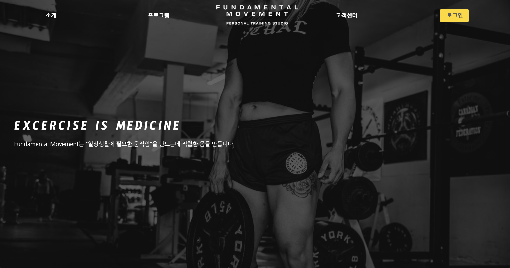&nbsp;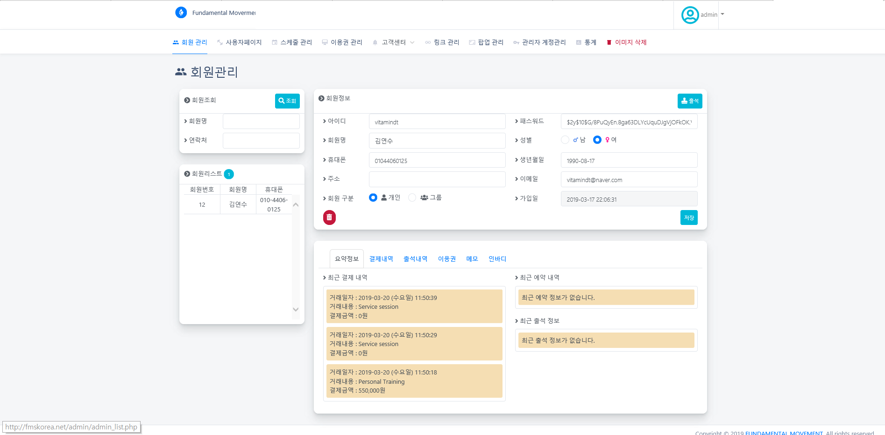

## 외주 프로젝트 2
[mylively (바로가기)](http://mylively.co)
### 개요
+ 개인 맞춤형 건강 솔루션
### 공헌 내용
+ 기간 : 2019.03 ~ 2019.04 (총 1개월)
+ 담당 : 웹 개발, 디자인
+ 반응형 홈페이지 제작 : 템플릿, Bootsrap4 활용, 제품 소개, 주문 조회
+ 문진 시스템 구현 : php, ajax 통신을 활용한 SPA 구현
+ Localstorage를 이용 데이터 임시 저장
+ 개발Tool : SublimeText3, phpmyadmin, Mysql Workbench
### 결과물 사진

&nbsp;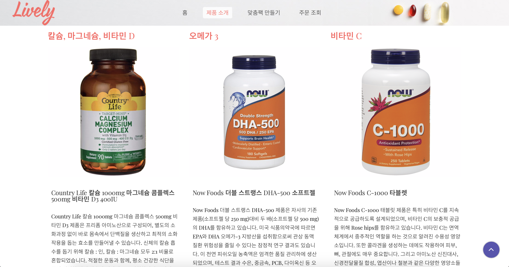&nbsp;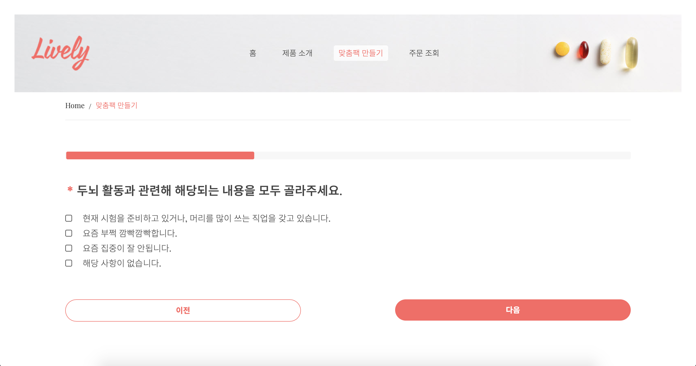

### 참여 회사
[아이언트레인 (바로가기)](https://www.irontrain.co.kr/)
+ 기간 : 2019.05 ~
+ 참여 프로젝트 : 출결버스, 보카트레인, 내공스터디

[출결버스 (바로가기)](https://www.checkbus.co.kr/)
### 개요
+ 학원 출결 관리 프로그램
### 공헌 내용
+ 담당 : 기능 추가 및 유지보수
+ 자주 쓰는 문자 UI, 성능 개선 (쿼리 최적화)
+ 모바일 앱 React Native 버전 업그레이드, 호환성 점검
+ API 문서화, 기타 잔 오류 수정
+ Tech : React Native, JQuery, PHP, Slim
### 결과물 사진

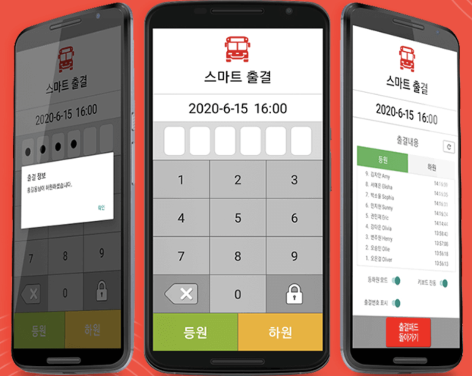&nbsp;&nbsp;

[보카트레인 (바로가기)](https://voca.irontrain.co.kr/)
### 개요
+ 온라인 단어 학습 프로그램
### 공헌 내용
+ 담당 : 기능 추가 및 유지보수
+ 관리자 페이지 오류 수정
+ Tech : Chrome extension, Cordova
### 결과물 사진

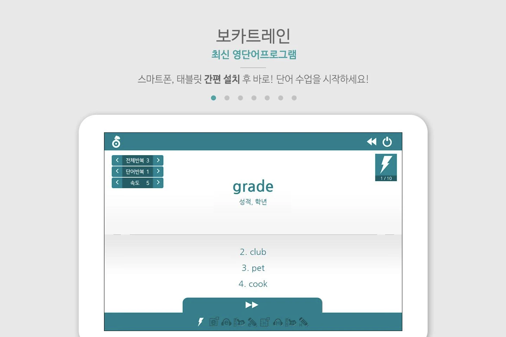&nbsp;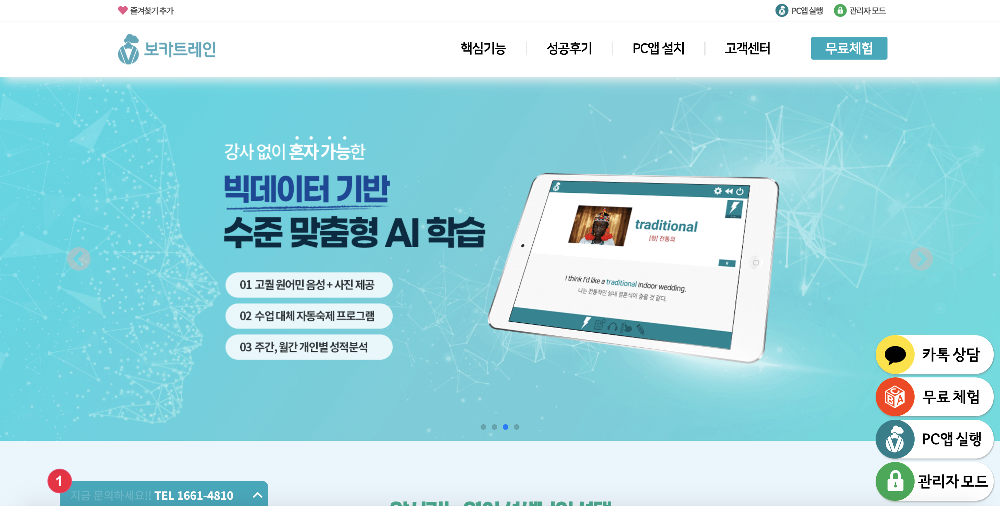&nbsp;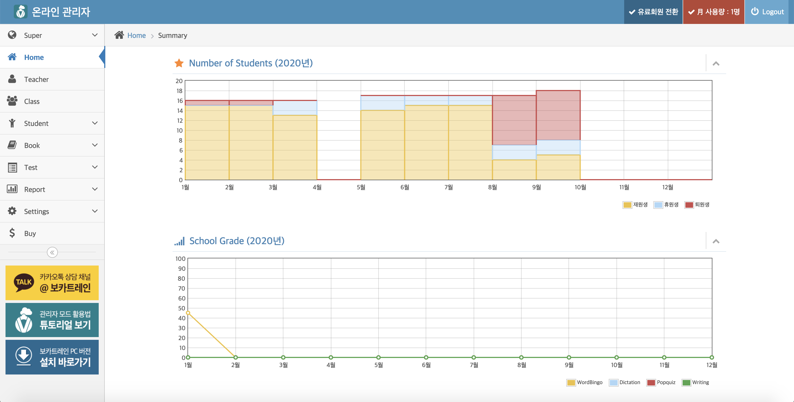

[내공스터디 (바로가기)](https://www.tabstudy.co.kr/)
### 개요
+ 온라인 학습 프로그램
### 공헌 내용
+ 담당 : 신규 개발
+ 학생 앱 지원, 관리자 앱 전면 개발
+ 주요기능 : 학생 관리, 수업 관리, 시험지 출력, 레포트 관리 등
+ eChart.js, html2canvas.js, jquery.columnizer.js 등 라이브러리 활용
+ Tech : Vue.js, jQuery, PHP, slim, redis, FireStore 등
### 결과물 사진

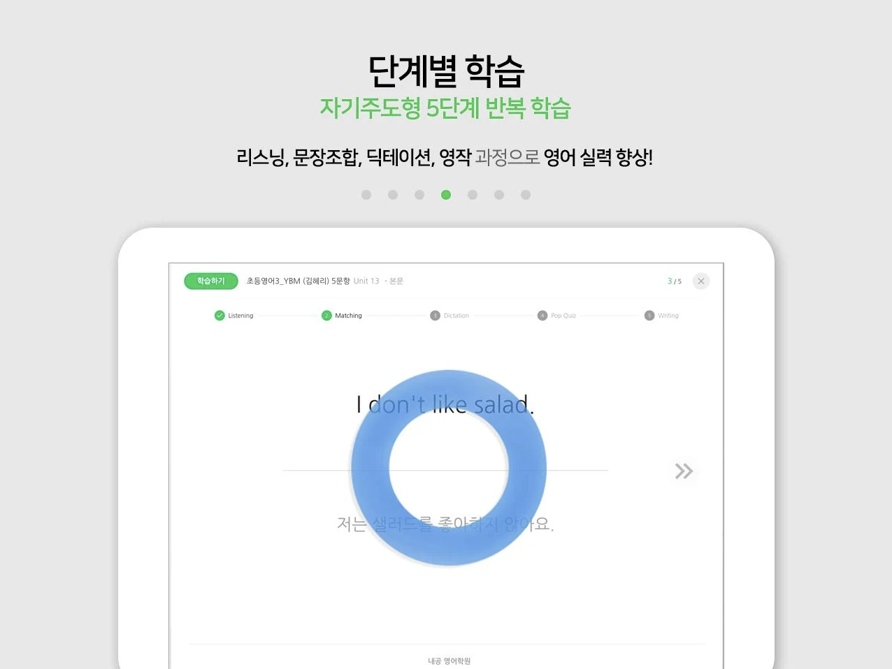&nbsp;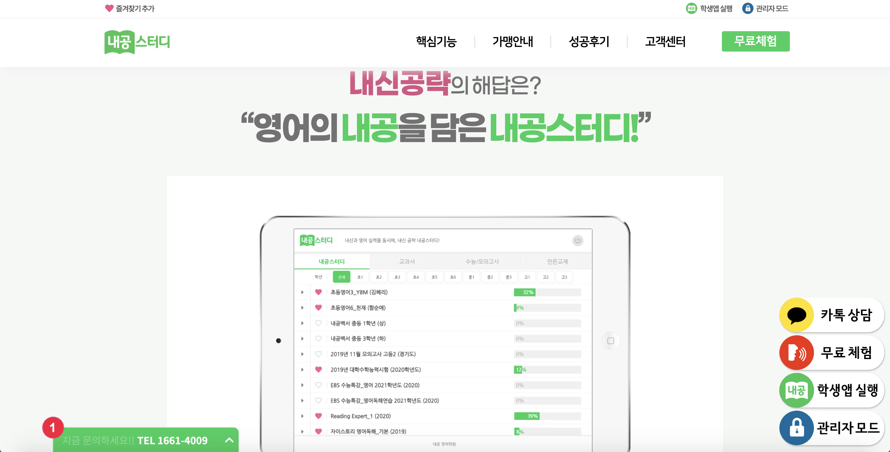&nbsp;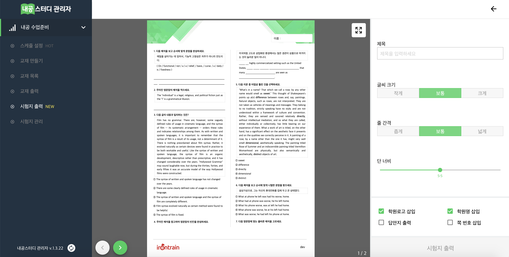

